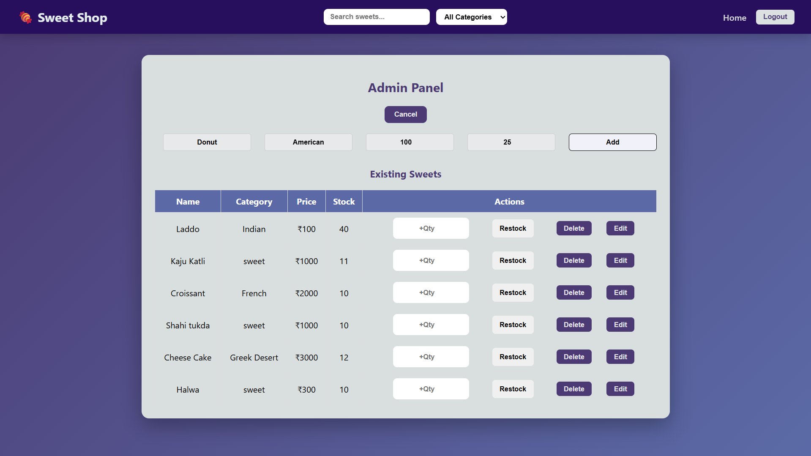
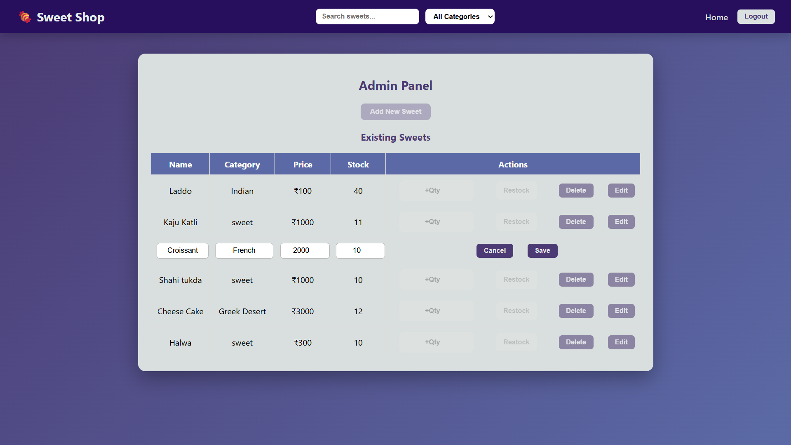

# Sweet Shop Management System

A full-stack Sweet Shop Management System designed to manage sweet inventory, enable users to browse and purchase sweets, and provide administrators with a secure dashboard for inventory management. The project emphasizes clean UI/UX, responsive design, and real-world business logic.

---

# Project Overview

This application simulates a real-world sweet shop where:
- Users can browse available sweets using search and category filters
- Admins can manage inventory securely
- Role-based access ensures proper authorization
- The interface is modern, responsive, and user-friendly

---

# Features

# User Features
- Browse sweets in a responsive grid layout
- Search sweets by name
- Filter sweets by category
- Secure login and registration
- Role-based navigation
- Clean and visually appealing UI

# Admin Features
- Add new sweets (name, category, price, stock)
- Edit sweet details inline
- Delete sweets
- Restock inventory with quantity validation
- Navbar-based search and category filtering
- Controlled editing (only one sweet editable at a time)
- Disabled conflicting actions during edit for safety
- Redirect to login after logout

---

# Design & User Experience

- Modern UI with background images and glassmorphism effects
- Sticky navbar with dynamic links
- Responsive layout for mobile, tablet, and desktop
- Clear visual feedback (hover effects, disabled states)
- Smooth animations (slide-down add form)
- Meaningful empty states (no results found, empty inventory)

> The design focuses on clarity, usability, and responsiveness to enhance the overall user experience.

---

# Technology Stack

# Frontend
- React (Create React App)
- React Router
- Context API (Authentication)
- Axios
- Custom CSS (Responsive Grid & UI Styling)

# Backend
- Node.js
- Express.js
- SQLite
- JWT Authentication
- Role-based Authorization
- Jest & Supertest (Testing)


# Backend Architecture

The backend of the Sweet Shop Management System is built using Node.js and Express.js, following a modular and layered architecture to ensure maintainability and scalability.

Architecture Overview

Server Layer (server.js)
Acts as the entry point of the application. It initializes the Express server, configures middleware, and registers API routes.

Database Layer (db.js)
Handles SQLite database connection and schema initialization. All database queries related to sweets and users are managed through this layer.

Authentication Layer (auth.js)
Manages user authentication using JWT (JSON Web Tokens). It includes login, registration logic, password handling, and token generation.

Authorization Middleware (middleware/auth.js)
Protects routes by validating JWT tokens and enforcing role-based access control (Admin/User).

Business Logic Layer (sweets.js)
Contains all core logic related to sweet inventory management, including adding, editing, deleting, restocking, and fetching sweets.

Testing Layer (tests/)
Includes automated tests written using Jest and Supertest to validate authentication and API functionality.

This layered structure separates concerns clearly, improves readability, and makes the backend easier to extend and test.

# API Endpoints Documentation
Authentication APIs
Method	Endpoint	Description	Access
POST	/auth/register	Register a new user	Public
POST	/auth/login	Login and receive JWT token	Public


| Method | Endpoint              | Description                   | Access     |
| ------ | --------------------- | ----------------------------- | ---------- |
| GET    | `/sweets`             | Fetch all available sweets    | User/Admin |
| POST   | `/sweets`             | Add a new sweet               | Admin      |
| PUT    | `/sweets/:id`         | Edit sweet details            | Admin      |
| DELETE | `/sweets/:id`         | Delete a sweet                | Admin      |
| POST   | `/sweets/:id/restock` | Restock a sweet with quantity | Admin      |


# Protected Routes

Routes that modify data require a valid JWT token
Admin-only routes enforce role-based authorization
Unauthorized access returns appropriate HTTP error responses


# Project Structure

shop-project/
├── backend/
│   ├── server.js
│   ├── db.js
│   ├── auth.js
│   ├── sweets.js
│   └── tests/
├── frontend/
│   └── sweet-shop-ui/
│       ├── src/
│       │   ├── api/
│       │   ├── components/
│       │   ├── context/
│       │   ├── pages/
│       │   └── styles/
│       ├── public/
│       ├── package.json
│       └── package-lock.json
└── .gitignore


# Getting Started

# Prerequisites
- Node.js (v16 or higher)
- npm

# Frontend Setup
```bash
cd frontend/sweet-shop-ui
npm install
npm start
Frontend runs on: http://localhost:3000

User Login
Email: abc@gmail.com
Password: 1234

Admin Login
Email: admin@gmail.com
Password: admin@123

# Backend Setup
cd backend
npm install
node server.js
Backend runs on: http://localhost:5000


# Authentication & Authorization

JWT-based authentication
Two roles supported:
User – can browse and purchase sweets
Admin – can manage sweets and inventory
Protected routes prevent unauthorized access


# My AI Usage

I used AI tools as part of my development workflow to improve efficiency, reduce repetitive work, and enhance code quality, while ensuring that I retained full responsibility for the final implementation and design decisions.

AI Tools Used
ChatGPT – Used for understanding concepts, generating initial boilerplate code, debugging issues, and refining UI/UX and workflow ideas.

How I Used AI

I used ChatGPT to generate initial boilerplate code for React components, Express routes, and configuration files, which helped speed up the project setup.
I used AI assistance to debug React state management and routing issues, especially while integrating global search and category filtering across multiple pages.
I consulted AI for improving UI/UX patterns, such as navbar behavior, admin dashboard interactions, form animations, and role-based navigation.
I used AI guidance to refine admin workflows, including controlled edit states, disabling conflicting actions during editing, and improving overall usability.
I also used AI to help understand and resolve Git-related issues such as repository structure, .gitignore configuration, commit practices, and AI co-authorship requirements.
All AI-generated suggestions were carefully reviewed, modified, and manually integrated. I did not directly copy large blocks of code without understanding them, and every feature was implemented with full awareness of how it works.


Impact on My Workflow
Using AI tools significantly improved my development workflow by reducing the time spent on repetitive tasks and helping me quickly identify solutions to common issues. This allowed me to focus more on application logic, design decisions, and user experience. At the same time, I ensured that AI did not replace my problem-solving process but acted as a learning and productivity aid.

AI usage throughout the project is transparently documented in the Git commit history using AI co-authorship, in accordance with the provided guidelines.


# Screenshots






